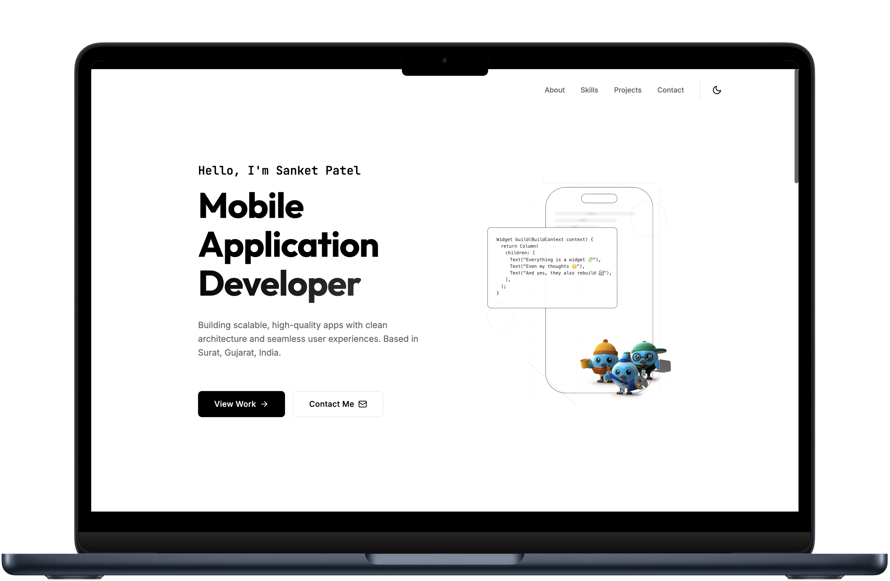
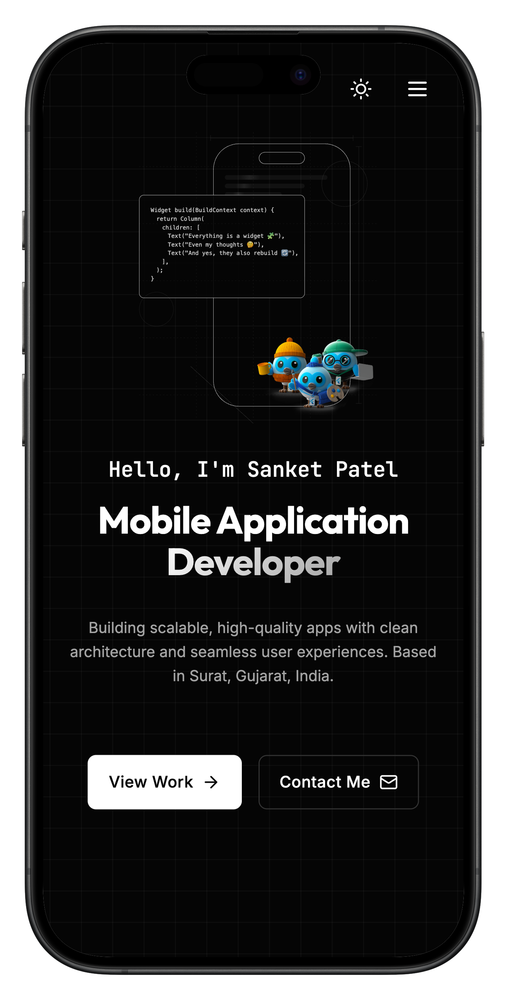

# s4nk37.github.io

<div align="center">
  
[](https://s4nk37.github.io)
[](LICENSE)
[](https://react.dev/)
[](https://www.typescriptlang.org/)
[](https://vitejs.dev/)

**A modern, responsive portfolio website showcasing my work as a Mobile Application Developer**

[Live Demo](https://s4nk37.github.io) • [Report Bug](https://github.com/s4nk37/s4nk37.github.io/issues) • [Request Feature](https://github.com/s4nk37/s4nk37.github.io/issues)

</div>

---

## 📑 Table of Contents

- [About](#-about)
- [Screenshots](#-screenshots)
- [Features](#-features)
- [What's Included](#-whats-included)
- [Tech Stack](#-tech-stack)
- [Getting Started](#-getting-started)
- [Usage](#-usage)
- [Deployment](#-deployment)
- [Project Structure](#-project-structure)
- [Customization](#-customization)
- [Browser Support](#-browser-support)
- [Performance](#-performance)
- [Contributing](#-contributing)
- [License](#-license)
- [Contact](#-contact)

---

## 🎯 About

This is my personal portfolio website built with modern web technologies. It features a sleek, minimalist design with smooth animations, dark/light mode support, and a fully responsive layout that works seamlessly across all devices.

The portfolio showcases my projects, articles, experience, and provides an easy way for visitors to connect with me.

---

## 📸 Screenshots

<div align="center">
  
### Desktop View


### Mobile View


</div>

---

## ✨ Features

### Core Features
- **🚀 Modern Tech Stack**: Built with React 19, TypeScript, and Vite for a fast and robust development experience
- **🎨 Smooth Animations**: Powered by Framer Motion for fluid, professional transitions and micro-interactions
- **📱 Fully Responsive**: Optimized for all screen sizes - mobile, tablet, and desktop with mobile-first approach
- **🌓 Dark/Light Mode**: Theme toggle with system preference detection and persistent theme storage
- **⚡ Fast Performance**: Optimized build with Vite for lightning-fast load times
- **♿ Accessible**: Semantic HTML, ARIA labels, and keyboard navigation support
- **🔍 SEO Optimized**: Proper meta tags, semantic structure, and sitemap
- **🏗️ Clean Architecture**: Component-based structure with reusable patterns and TypeScript for type safety

### Design Features
- **🎭 Custom Animations**: Blueprint-style SVG animations with technical sketch aesthetics
- **💫 Smooth Scrolling**: Enhanced scroll behavior with smooth transitions
- **🎯 Interactive Elements**: Hover effects, transitions, and engaging user interactions
- **📐 Grid Layouts**: Modern CSS Grid and Flexbox for responsive layouts
- **🎨 Gradient Text**: Eye-catching gradient text effects for headings

---

## 📋 What's Included

The portfolio includes the following sections:

- **🏠 Hero Section**: Eye-catching introduction with animated visuals
- **👤 About Section**: Personal introduction and background
- **💼 Projects Section**: Showcase of featured projects with descriptions and links
- **📝 Articles Section**: Latest blog posts and articles from Medium
- **📧 Contact Section**: Easy way to get in touch via email
- **🔗 Footer**: Social media links (GitHub, LinkedIn, X, StackOverflow) and copyright

---

## 🛠️ Tech Stack

### Frontend
- **[React 19](https://react.dev/)** - UI library with latest features
- **[TypeScript](https://www.typescriptlang.org/)** - Type-safe JavaScript
- **[Vite 7](https://vitejs.dev/)** - Next-generation build tool
- **[Framer Motion](https://www.framer.com/motion/)** - Production-ready motion library
- **[Lucide React](https://lucide.dev/)** - Beautiful icon library

### Development Tools
- **ESLint** - Code linting and quality
- **TypeScript ESLint** - TypeScript-specific linting rules

### Deployment
- **[GitHub Pages](https://pages.github.com/)** - Free hosting for static sites
- **gh-pages** - Automated deployment to GitHub Pages

---

## 🏁 Getting Started

To get a local copy up and running, follow these simple steps.

### Prerequisites

Ensure you have Node.js (v18 or higher) and npm installed on your machine.

```sh
node --version
npm --version
```

### Installation

1. **Clone the repository**
   ```sh
   git clone https://github.com/s4nk37/s4nk37.github.io.git
   ```

2. **Navigate to the project directory**
   ```sh
   cd s4nk37.github.io
   ```

3. **Install dependencies**
   ```sh
   npm install
   ```

---

## 🏃 Usage

### Development

Start the development server with hot reload:

```sh
npm run dev
```

The site will be available at `http://localhost:5173`

### Production Build

Build for production (output to `dist/` folder):

```sh
npm run build
```

### Preview Production Build

Preview the production build locally:

```sh
npm run preview
```

### Linting

Run ESLint to check for code quality issues:

```sh
npm run lint
```

---

## 🚀 Deployment

This project is configured for GitHub Pages deployment.

### Deploy to GitHub Pages

```sh
npm run deploy
```

This command will:
1. Build the project (`npm run build`)
2. Deploy the `dist/` folder to the `gh-pages` branch
3. Make your site live at `https://s4nk37.github.io`

**Note**: Ensure your repository settings have GitHub Pages enabled and set to deploy from the `gh-pages` branch.

### Manual Deployment

1. Build the project: `npm run build`
2. Push the `dist/` folder contents to the `gh-pages` branch
3. Your site will be live at `https://s4nk37.github.io`

---

## 📦 Project Structure

```
s4nk37.github.io/
├── public/                 # Static assets
│   ├── images/            # Image assets
│   ├── icons/             # Icon files
│   ├── videos/            # Video assets
│   └── ...                # Other static files
├── src/
│   ├── components/        # React components
│   │   ├── Layout/        # Layout components
│   │   │   ├── Navbar.tsx # Navigation bar with theme toggle
│   │   │   └── Footer.tsx # Footer with social links
│   │   ├── Sections/      # Page sections
│   │   │   ├── Hero.tsx   # Hero/intro section
│   │   │   ├── About.tsx  # About me section
│   │   │   ├── Projects.tsx # Projects showcase
│   │   │   ├── Articles.tsx # Articles/blog section
│   │   │   ├── Contact.tsx  # Contact section
│   │   │   └── Experience.tsx # Experience section (optional)
│   │   ├── UI/            # UI components
│   │   │   └── ThemeToggle.tsx # Theme switcher
│   │   └── Visuals/       # Animation components
│   │       └── MobileAnimation.tsx # Custom animations
│   ├── styles/            # Global styles
│   │   └── global.css     # CSS variables and global styles
│   ├── assets/            # Local assets
│   ├── App.tsx            # Main app component
│   ├── main.tsx           # App entry point
│   └── index.css          # Base styles
├── dist/                  # Production build output
├── package.json           # Dependencies and scripts
├── vite.config.ts         # Vite configuration
├── tsconfig.json          # TypeScript configuration
└── README.md              # This file
```

---

## 🎨 Customization

To customize this portfolio for your own use:

### 1. Update Personal Information
- **Hero Section**: Edit `src/components/Sections/Hero.tsx`
- **About Section**: Edit `src/components/Sections/About.tsx`
- **Projects**: Update projects in `src/components/Sections/Projects.tsx`
- **Articles**: Update articles in `src/components/Sections/Articles.tsx`
- **Contact**: Update email in `src/components/Sections/Contact.tsx`

### 2. Update Social Links
- **Footer**: Edit social links in `src/components/Layout/Footer.tsx`
- **Navbar**: Edit social links in `src/components/Layout/Navbar.tsx` (if applicable)

### 3. Customize Styling
- **Colors**: Modify CSS variables in `src/styles/global.css`
  - `--primary-color`, `--bg-color`, `--text-primary`, etc.
- **Fonts**: Update font families in `src/styles/global.css`
- **Spacing**: Adjust spacing variables (`--spacing-xs`, `--spacing-sm`, etc.)

### 4. Update Animations
- **Visual Components**: Modify `src/components/Visuals/`
- **Framer Motion**: Adjust animation props in section components

### 5. Update Meta Tags
- Edit `index.html` in the root directory for SEO and social sharing

### 6. Update Deployment
- Change repository name in `package.json`
- Update GitHub Pages settings in your repository

---

## 🌐 Browser Support

This portfolio is tested and works on:

- ✅ Chrome (latest)
- ✅ Firefox (latest)
- ✅ Safari (latest)
- ✅ Edge (latest)
- ✅ Mobile browsers (iOS Safari, Chrome Mobile)

**Note**: Some features like smooth scrolling and CSS Grid may have limited support in older browsers.

---

## ⚡ Performance

This portfolio is optimized for performance:

- **Fast Load Times**: Vite build optimization
- **Code Splitting**: Automatic code splitting with Vite
- **Optimized Assets**: Compressed images and assets
- **Lazy Loading**: Components load as needed
- **Minimal Dependencies**: Only essential packages included

### Performance Tips

- Images should be optimized before adding to `public/images/`
- Use WebP format for better compression
- Keep component sizes reasonable for faster initial load

---

## 🤝 Contributing

Contributions, issues, and feature requests are welcome! 

1. Fork the repository
2. Create your feature branch (`git checkout -b feature/AmazingFeature`)
3. Commit your changes (`git commit -m 'Add some AmazingFeature'`)
4. Push to the branch (`git push origin feature/AmazingFeature`)
5. Open a Pull Request

Feel free to check the [issues page](https://github.com/s4nk37/s4nk37.github.io/issues) for open issues.

---

## 📄 License

Distributed under the MIT License. See `LICENSE` for more information.

---

## 📧 Contact

**Sanket Patel**

- Twitter: [@s4nk37](https://x.com/s4nk37)
- LinkedIn: [s4nk37](https://www.linkedin.com/in/s4nk37/)
- GitHub: [s4nk37](https://github.com/s4nk37)
- Email: s4nk37@zohomail.in
- Portfolio: [s4nk37.github.io](https://s4nk37.github.io)
- Medium: [s4nk37](https://s4nk37.medium.com/)

---

<div align="center">

⭐ If you found this helpful, please consider giving it a star!

Made with ❤️ by [Sanket](https://github.com/s4nk37)

</div>
